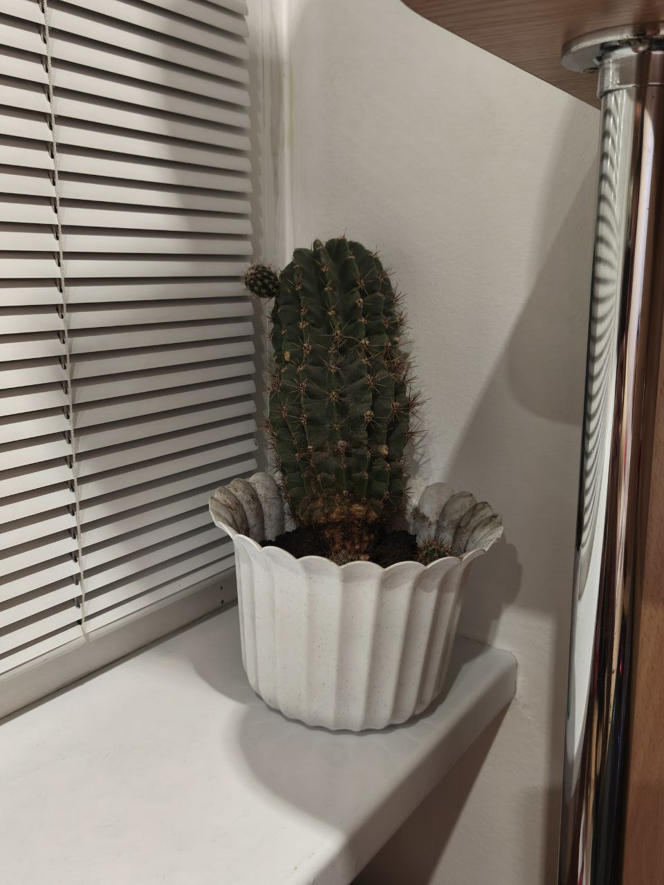
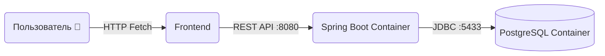

# Лаба 2+1: Cactus Tracker & Oracle

Привет, Ван.

Проект простой как пять копеек. Скажу сразу: доза была высокая.

## Стек технологий
*   **Backend:** Java 25 (Spring Boot 3.чёто там).
*   **Database:** PostgreSQL 15 - хранит историю настроения и диалоги.
*   **Frontend:** HTML5 + CSS3 + ванильный JS (Fetch API).
*   **Infrastructure:** Docker + Docker Compose.

## Архитектура

Чтобы было понятно, какой объем работ проделан, вот схема работы:

1.  **Client (Browser):** Отправляет JSON-запросы (GET/POST/DELETE) на порт `8080`.
2.  **Controller (Spring Boot):**
    *   Принимает запрос.
    *   Если это вопрос "Оракулу" - генерирует случайный ответ на украинском ("Потужно!", "Ні" и т.д.).
    *   Благодаря `@CrossOrigin(origins = "*")` работает даже со шпионских страниц (CORS настроен).
3.  **Repository (Hibernate/JPA):** Мапит Java-объекты в таблицы БД.
4.  **PostgreSQL (Docker Container):** Надежно хранит данные на порту `5433` внутри изолированной сети `docker-network`.


## Как запустить (Инструкция для проверки)
### Шаг 1. Сборка проекта
В корне проекта даем права и собираем JAR-ник (пропускаем тесты для скорости):
```code Bash
chmod +x mvnw
./mvnw clean package -DskipTests
```
### Шаг 2. Запуск инфраструктуры
Поднимаем базу и приложение:
```code Bash
docker-compose up --build
```
### Шаг 3. Проверка
Заходим в браузер: http://localhost:8080
Кликаем кнопки - данные сохраняются.
Обновляем страницу - данные подтягиваются из Postgres.
Бонус: Шпионская страница spy.html тоже работает, так как я открыл CORS.
# САМОЕ ГЛАВНОЕ
## Зачем нужны Java и докер? Почему вы захотели быть программистом?
Лично мне джава не нравится. Докер прикольный, полезный, мне нравится, чтобы подгрузить всё окружение и запускать на любых компах. Ну а также для нормального CI/CD очев. 
Олмпрогой занимался🤓🤓🤓🤓 вот и буду тыкать кнопочки и получать деньги🤓🤓🤓
## Почему я ненавижу винду?
Все ненавидят, я тоже. Но я люблю игрульки, так что винда у меня есть. А так у них плачевное winapi, а также жоская инкапусляция. Пусть сами и прогают на своей винде емае

## Какие интересы у вашего любимого преподавателя?
У Александра Владимировича переносить стопочки на кафедре. Мой любимый преподаватель, ибо мне нравится линал, и он понятно и просто объяснял.

